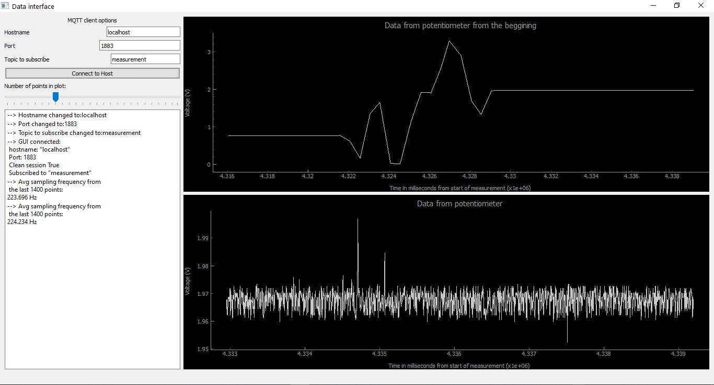
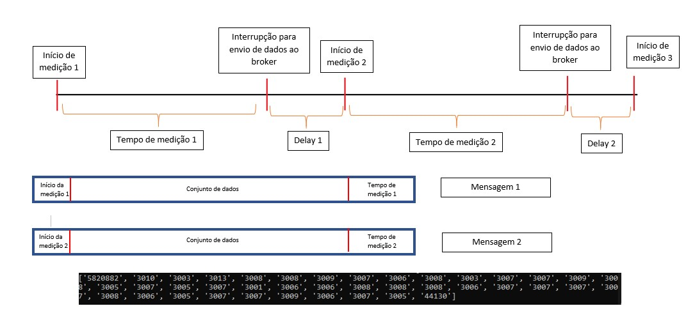
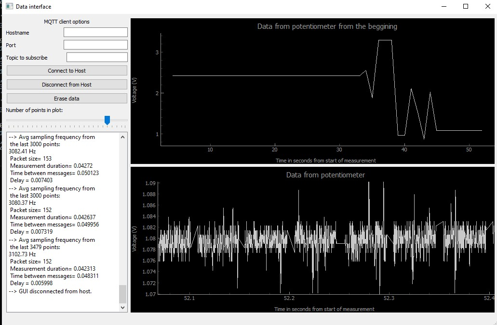

# Projeto Final

## Objetivo:

Pretende-se medir a voltagem na divisão de tensão no poteciómetro dado, enviar os dados através do esp32 para um broker alojado no PC e através também de um cliente local (usando a livraria ) mostrar esses dados em tempo real através de um GUI desenvolvido em PyQt5 usando para suporte gráfico pyqtgraph.  

## Overview da interface gráfica



Do lado direito temos dois gráficos que são a parte principal da interface. O gráfico inferior mostra os dados à medida que vão sendo recebidos pelo broker MQTT e o gráfico superior mostra a evolução temporal dos dados devolvidos pelo potenciómetro desdo o início da medição, onde cada ponto representa o valor médio dos últimos 10 pontos aquando a sua atualização que ocorre a cada segundo. No lado esquerdo, temos algumas opções que permitem configurar a ligação ao broker podendo então ligar a outro além do `localhost`. O botão 'Connect to Host" permite fazer a ligação ao broker com as credenciais definidas. Podemos ainda desligarmo-nos do *host* (botão "Disconnect from Host") e podemos apagar os dados presentes nos gráficos a qualquer momento recomeçando uma nova medição com o botão "Erase data". Finalmente tem um painel que permite colocar mensagens e é a *porta* de comunicação entre o programa e o utilizador.

## Explicação do código-fonte

### No ESP32

No microcontrolador encontram-se 3 scripts python: `main.py`, `boot.py` e `umqttsimple.py`. O segundo apenas realiza a ligação à rede wifi através do uso do `import network` seguindo um processo standard em todo semelhante ao que foi visto na aula. No ficheiro *main* pretende-se realizar 3 tarefas principais:

1. Configurar a ligação ao broker alojado no PC;
2. Configurar o ADC para a leitura dos dados da tensão na divisão do potenciómetro;
3. Configurar dados a enviar para o broker e publica-los.

#### Ligação ao broker

Para a ligação ao broker foi feito uso do pacote `umqttsimple.py` que pretende simplificar o processo de ligação de uma forma intuitiva e simples.

A rotina `connect()` tem como função principal instanciar o cliente mqtt importado de `umqttsimple.py` colocando a identificação dos dispositivo em `client_id` e o endereço IP do servidor em `mqtt_server`. Depois basta chamar o método `.client()` para tentar a ligação. A função `restart_and_reconnect()` destina-se a fazer *reset* ao microcontrolador e tentar uma nova ligação.
```python
topic_pub = b'measurement'

def connect():
    global client_id, mqtt_server

    client = MQTTClient(client_id, mqtt_server)
    client.connect()
    print('Connected to %s MQTT broker' % (mqtt_server))
    return client

def restart_and_reconnect():
    print('Failed to connect to MQTT broker. Reconnecting...')
    sleep(10)
    reset()
```

A ligação é configurada pelas seguintes linhas:
```python
try:
    client = connect()
except OSError as e:
    restart_and_reconnect()
```

#### Recolha de dados pelo ADC

Após ter o esp ligado ao nosso broker temos de retirar dados para poder enviar, para isso fazemos uso do potenciómetro que vinha na placa que pretende simular um sensor. Depois de fazer `from machine import ADC`, é iniciado o objeto ADC no pino dedicado, 32

```python
adc = ADC(Pin(32))
```


Escolhendo ler uma gama total de 0 a 3.3 volts:
```python
adc.atten(ADC.ATTN_11DB)
```
E finalmente escolhemos trabalhar com uma resolução de 12 bits:

```python
adc.width(ADC.WIDTH_12BIT)
```
### Preparação dos dados

Começamos por definir as duas escalas de tempo que dominam o sistema:
```python
message_interval = 50 #in miliseconds
sample_freq=1000 #Hz
ticks_max=ticks_add(0,-1)
print("Time intil clock resets: ", ticks_max/1e6/60, " minutes")
```
Define-se o intervalo de tempo em que vamos enviar dados para o broker (`message_interval`) e definimos a taxa de amostragem (é um número ilustrativo apenas, na prática vamos ver que nem sempre se vai cumprir esta frequência). Para uma amostragem com mais resolução vamos usar a função `ticks_us()`, contudo este contador tem um limite até que comece do 0 novamente. Porém, este limite está acima dos 10 minutos e para o nosso uso está ótimo, mas se se pretender usos alargados desta aplicação é um detalhe importante a ter em conta.

Vamos atuar nestas 2 escalas de forma diferente: para enviar os dados para o broker, fazemos uso de *interrupt requests*, já para a recolha de dados seguimos um *polling*. A razão para esta escolha está no facto de não colocar ambas as operações em *polling* dado que o processo não é o ideal e iria requerer operações adicionais desnecessárias e ocupar tempo precioso. Idealmente deveria ter sido ao contrário (*polling* para escala de tempo maior e *interrupt requests* para a menor) porém, não foram encontrados *Timers* disponíveis que contasse abaixo dos milissegundos. Assim sendo, definimos o nosso Timer virtual num modo periódico:

```python 
tim = Timer(-1)
tim.init(period=message_interval, mode=Timer.PERIODIC, callback=publish)
```
Cuja *callback* é:
```python
start_beggining=ticks_us() #saves the start of the measurement
data=[]

def publish(*args):
    global data
    global start_beggining

    data.append(ticks_diff(ticks_us(),start_beggining))
    client.publish(topic_pub,ujson.dumps(data))

    data=[ticks_us()] #initiates a new data packet
    start_beggining=ticks_us() #saves the new measurement beggining
```

onde estão definidas as variáveis `start_beggining` e `data` num scope global. A primeira destina-se a guardar o ínicio de cada medição e a segunda a guardar os dados de cada medição. Note-se que, a publicação de mensagens é feita através da conversão do nosso array num formato *json*. De acordo com [este link](https://stackoverflow.com/questions/38566095/how-can-i-send-a-list-using-mqtt) as mensagens a enviar pelo protocolo MQTT apenas estão restringidas a *byte arrays* e não tem um formato inerente. Assim, *strings* são de facto uma solução mas não é a única, e verificou-se que o armazenamento dos dados numa *string* poderia ser mais lente por cerca de 2 ordens de grandeza face ao armazenamento numa lista e posterior conversão para um ficheiro *json*. O tratamento será diferente na parte do cliente do GUI mas certamente continua mais rápido do que usar *strings*

Tendo estas ferramentas prontas definimos o loop principal. Primeiro temos de saber o intervalo de tempo entre amostras:
```python
dt=int(1/sample_freq*1e6)
```
Definimos também a primeira deadline do loop:
```python
deadline=ticks_add(ticks_us(),dt) #calculate the deadline
```

Finalmente:
```python
while True:
        try:       
            if ticks_diff(deadline,ticks_us())<=0:
                data.append(adc.read())
                deadline=ticks_add(ticks_us(),dt)

        except OSError as e:
            restart_and_reconnect()
```
A condição *if* traduz-se para "Se já passou um intervalo de tempo `dt` então tira uma nova medição, adiciona ao array `data` e define uma nova `deadline`". Para concluir o script usamos a sintax try/except/finally para apanhar a interrupção do teclado e desligar o timer definido para a publicação de mensagens:
```python 
try:
    loop()
except KeyboardInterrupt:
    print("Time to go now. Shutting down...")
finally:
    tim.deinit()
```
### No cliente local

A abordagem para a incorporação do protocolo MQTT com PyQt5 segue de muito perto a abordagem apresentada [neste post](https://stackoverflow.com/questions/52623799/use-paho-mqtt-with-pyqt), tendo claro algumas simplificações dado que não era necessária a mesma complexidade. Nesta parte será explicado o código do script `interface_2.py`. Os import necessários para o script são:

```python
from PyQt5 import QtCore, QtGui, QtWidgets
import pyqtgraph as pg
import paho.mqtt.client as mqtt
import sys
import numpy as np
```
#### Criação do cliente MQTT na terminologia Qt

Começamos por definir uma classe que irá herdar as propriedades do um objeto Qt e definir os *signals* que estamos interessados:
```python
class MQTT_Client(QtCore.QObject):
    # Define the signals. Qt terminology.

    messageSignal = QtCore.pyqtSignal(str)
    connected = QtCore.pyqtSignal()
    disconnected = QtCore.pyqtSignal()
```
Estes sinais vão permitir mais tarde definir callbacks respectivos. Note-se que no sinal `messageSignal` passamos o argumento da mensagem recebida pelo broker. Passando agora ao contrutor, começamos por definir as configuração *default* para a ligação ao broker e de seguida definimos as *callbacks* requeridas pelo protocolo MQTT:
```python
    def __init__(self):
        QtCore.QObject.__init__(self)

        # define your default client settings
        self.host = "localhost"
        self.port = 1883
        self.keepAlive = 60
        self.cleanSession = True
        self.subscribe_topic = "measurement"

        self.state = "disconnected"  # created to keep track of the state of the client

        # Create the paho client and set your callbacks
        self.client = mqtt.Client(clean_session=self.cleanSession)
        self.client.on_connect = self.on_connect1
        self.client.on_message = self.on_message1
        self.client.on_disconnect = self.on_disconnect1
```
Essas funções são definidas apenas como o "intermediário" para a emissão de um sinal para o GUI onde este terá efetuado as ligações aos *slots* respectivos (o termo *slot* será usado intercalado com *callbacks* quando se referem ao GUI), pelo que apenas estão definidas como:
```python
    def on_message1(self, mqttc, obj, msg):
        mstr = str(msg.payload)
        self.messageSignal.emit(mstr)  # Emit the signal.Qt terminology
```
Todas as outras são semelhantes alterando apenas a variável `mstr` e alterando o sinal respectivo. São definidos ainda 2 slots adicionais que permitem fazer a ligação com o broker ou encerrar a sessão:

```python
@QtCore.pyqtSlot()
    def connectToHost(self):
        # The function to connect the client to the broker.

        self.client.connect(self.host,
                            port=self.port,
                            keepalive=self.keepAlive)
        self.state = "connected"
        self.client.subscribe(self.subscribe_topic)
        self.client.loop_start()
        print("connected")

    @QtCore.pyqtSlot()
    def disconnectFromHost(self):
        # Call this function if you want to disconnect the broker
        self.client.loop_stop()
        self.state = "disconnected"
        self.client.disconnect()
```

Nota que aqui deve ser usada a função `.loop_start()` para que o programa não seja bloqueado e o GUI continue responsivo. Da mesma forma, para desligar do broker deve ser usada a sua contraparte `.loop_stop()`.

#### Construção do GUI 

Nesta parte apenas serão descritas as partes do código que introduzem alguma dinâmica e não será feita referência às primeiras 100 linhas de código do construtor `setupUI(self,MainWindow)` do objeto `Ui_MainWindow` que lidam com a estrutura da aplicação (*layouts*, posicionamento dos vários objetos, dimensões, etc.). Assim sendo, começamos por inicializar e costumizar os nossos gráficos:
```python
class Ui_MainWindow(object):
    def setupUi(self, MainWindow):
        
        (.......)

        # initialize the live data plot
        self.N = 3000  # pre set the amount of points the live data plot
        self.xdata = [0]  # initialize some dummy data
        self.ydata = [0]

        # instance the curve object
        self.curve1 = pg.PlotDataItem(self.xdata, self.ydata)
        self.plot.addItem(self.curve1)
        self.plot.setLabels(title="Data from potentiometer",
                            bottom="Time in seconds from start of measurement", left="Voltage (V)")

        # initialize the long range data plot
        self.xdata_long = [0]
        self.ydata_long = [0]
        self.curve2 = pg.PlotDataItem(self.xdata_long, self.ydata_long)
        self.plot_long.addItem(self.curve2)
        self.plot_long.setLabels(title="Data from potentiometer from the beggining",
                                 bottom="Time in seconds from start of measurement",
                                 left="Voltage (V)")
```

Pretende-se ter 2 gráficos. Um para mostrar os dados desde o ínicio da medição que é atualizado a cada segundo mostrando uma média atritmética dos 10 últimos pontos recebidos para suavizar a curva. Iniciamos os gráficos com uma lista vazia e criamos os objetos `PlotDataItem`. 

Iniciamos o cliente MQTT definido anteriormente:
```python
self.client = MQTT_Client()
```
 E agora iniciamos as ligações que vão conferir a dinâmica da aplicação. O primeiro ponto é definir a resposta aquando a receção de uma mensagem:
 ```python
 self.client.messageSignal.connect(self.onMessage)
 ```

 Logo quando é emitido um sinal de receção de mensagem no cliente a função (ou *slot*) `self.onMessage` é executada. Para entender o tratamento precisamos de olhar a como os dados são enviados e recebidos:



Na imagem está descrita a linha cronológica dos eventos mediante o programa apresentado em cima para o envio de 2 mensagens. Os dados são recolhidos durante um certo intervalo de tempo e depois temos uma interrupção para o envio dos dados. Assim sendo, pode-se j+a prever que os dados irão conter "quebras" periódicas. A estruturação das mensagens está ilustrada nas caixas azuis: o primeiro objeto é o instante de tempo em que a medição se iniciou devolvido pela função `ticks_us()` seguido das várias medições recolhidas durante um intervalo dado por `message_interval` e finalmente contém o intervalo de tempo desde o início da medição até ao envio dos dados (idealmente seria exatamente igual a `message_interval` mas existem algumas flutuações). Vemos que com exceção do primeiro e do ultimo objeto de cada mensagem os dados vêm separados por `" ,"`, por isso podemos recuperar os dados da seguinte forma:

```python
def onMessage(self, msg):
        # Handles the reception of a new message from the broker
        data = msg.split(", ")

        data[0] = data[0][3:]
        data[-1] = data[-1][:-2]

```
Agora temos de distinguir 2 situações: é a primeira mensagem recebida ou não. Esta distinção é feita pela variável `self.first_message` definida aquando a ligação ao broker. Começamos por guardar o inicio da mensagem anterior para que nas seguintes mensagens sejam calculados os *delays* respectivos (ver imagem). Depois definimos o espaçamento temporal entre amostras em `self.dt`:

```python
        if self.first_message:
            self.previous_start = int(data[0]) #save the start of the first message
            self.dt = int(data[-1])/1e6/len(data[1:len(data)-1])  # in seconds. Time interval between samples   
```

Reunimos agora os dados a adicionar aos gráficos:
```python
            voltage = [int(i)/4095*3.3 for i in data[1:len(data)-1]]
            time = [self.xdata[-1]+i*self.dt for i in range(len(voltage))]
            self.first_message = False
```
A situação em que não é a primeira mensagem é tratada de uma forma em toda análoga mas apenas temos agora em conta o delay para uma correta visualização dos dados:

```python
        else:
            self.time_between_msgs = int(data[0])-self.previous_start
            self.delay = self.time_between_msgs-int(data[-1])

            self.delay = self.delay/1e6  # in seconds
            self.dt = int(data[-1])/1e6/len(data[1:len(data)-1])  # in seconds

            voltage = [int(i)/4095*3.3 for i in data[1:len(data)-1]]
            time = [self.xdata[-1]+i*self.dt +
                    self.delay for i in range(len(voltage))]
            
            self.previous_start = int(data[0])
```

Ao mesmo tempo são também reunidos alguns dados de interesse para depois imprimir no *listWidget*:
```python
            # Just to get the current packet size
            self.packet_size = len(voltage)
            self.meas_duration=int(data[-1])/1e6
            
```
Finalmente atualizamos o nosso gráfico de *live data* restringido a um número fixo de pontos, N:
```python
        self.ydata += voltage
        self.xdata += time

        N = self.N
        if len(self.xdata) >= N:
            self.xdata = self.xdata[-N:]
            self.ydata = self.ydata[-N:]

        try:
            self.curve1.setData(self.xdata[1:], self.ydata[1:])
        except IndexError:
            pass
```

Voltando ao nosso construtor, a próxima ligação é no botão para a ligação ao broker:
```python
self.button_conn.clicked.connect(self.connect)
```
O método `self.connect` distingue a situação em que a aplicação já está ligada (através da afirmação *if/else*) e apanha possíveis erros na ligação (através da sintaxe *try/except*) nomeadamente definições erradas do nome do host, port ou tópico a subscrever. Os timers definidos para a impressão de alguns dados na listWidget e atualização do gráfico de dados a longo prazo são também inicializados nesta função:

```python
   def connect(self):
        # handles the connection after clicking the button
        if self.client.state == "connected":
            self.listWidget.addItem("-->Already connected to a host")
        else:
            try:
                self.client.connectToHost()
                self.listWidget.addItem("--> GUI connected: \n hostname: \"{}\"   \n Port: {} \n Clean session {} \n Subscribed to \"{}\"".format(
                    self.client.host, self.client.port, self.client.cleanSession, self.client.subscribe_topic))

                self.first_message = True  # set the first message criteria on connection
                # start the timers
                self.qtimer.start()
                self.qtimer1.start()

            except:
                self.listWidget.addItem("--> Something went wrong. Try again")
```
De seguida, temos a ligação do botão de *disconnect* cujo slot foi definido de uma forma em todo semelhante à função anterior, apenas substituindo `self.client.connectToHost()` por `self.client.disconnectFromHost()`, `self.qtimer.start()` por `self.qtimer.stop()` (de igual forma para o `qtimer1`) e foram alteradas as impressões no `listWidget`:
```python
self.button_disconn.clicked.connect(self.disconnect)
```

O botão de erase data tem também um slot definido de uma forma bastante simples, apenas apagamos todos os dados e atualizamos as curvas respectivas:
```python
(...)
        self.button_erase_data.clicked.connect(self.erase_data)

(...)
    def erase_data(self): 
        #Erase all data from the plots
        self.xdata = [0]
        self.ydata = [0]
        self.curve1.setData(self.xdata, self.ydata)

        self.xdata_long = [0]
        self.ydata_long = [0]
        self.curve2.setData(self.xdata_long, self.ydata_long)

        self.first_message = True
```

No slider podemos definir o número de pontos no gráfico de *live data*:
```python
(...)
        self.horizontalSlider.valueChanged.connect(self.set_n)
(...)
    def set_n(self, value):
        # handles the change on the slider for the number of points.
        n_points = [50*i for i in range(1000)]
        self.N = n_points[value]
```
Relativamente às edições das linhas temos todas os slots muito semelhantes:

```python
    (...)
        self.line_host.editingFinished.connect(self.host_edit)
        self.line_port.editingFinished.connect(self.port_edit)
        self.line_topic.editingFinished.connect(self.topic_edit)
    (...)
    def host_edit(self):
        # reassigns the new hostname based on the line edit
        text = self.line_host.text()
        if text == "":  # catches the null editing of a line
            pass
        else:
            self.client.host = text
            self.listWidget.addItem("--> Hostname changed to:{}".format(text))

    def port_edit(self):
        (...)
    def topic_edit(self):
        (...)
```
Finalmente, temos os nossos timers que são responsáveis pela impressão de informação de uma forma periódica no *listWidget* e pela atualização do gráfico de todos os dados:

```python
        # adding a timer to get the long ranged data
        self.qtimer = QtCore.QTimer()
        self.qtimer.setInterval(1000) #set timeout interval. Miliseconds
        self.qtimer.timeout.connect(self.get_long_data)# Connect the timeout event to a slot

        # Second timer to get the frequency
        self.qtimer1 = QtCore.QTimer()
        self.qtimer1.setInterval(10000)#set timeout interval. Miliseconds
        self.qtimer1.timeout.connect(self.get_freq)# Connect the timeout event to a slot

    def get_freq(self):
        # Prints data on the listwidget
        try:
            x = np.asarray(self.xdata)
            xdiff = x[1:]-x[:len(x)-1]
            dt = np.mean(xdiff)
            self.listWidget.addItem(
                "--> Avg sampling frequency from \n the last {} points:\n{} Hz \n Packet size= {} \n Measurement duration= {} \n Time between messages= {} \n Delay = {}".format(len(x), str(1/dt)[:7], self.packet_size, self.meas_duration, self.time_between_msgs/1e6, self.delay))
        except RuntimeWarning:
            pass
    (...)
    def get_long_data(self):
        if len(self.xdata) > 1:
            try:
                self.xdata_long.append(self.xdata[-1])
                self.ydata_long.append(np.mean(self.ydata[-10:]))
                self.curve2.setData(self.xdata_long[1:], self.ydata_long[1:])
            except IndexError:
                pass
```

## Limitações do projeto

Verifica-se que para baixas frequências de amostragem existe uma boa coerência entre o valor inserido (até aos 200Hz). Para altas frequências o mesmo não é verdade e verifica-se uma grande discrepância e reconhece-se que o método que se está a usar para o cálculo da frequência de amostragem não é perfeito, contudo podemos tirar um valor ilustrativo dessa frequência e verifica-se que atinge o seu máximo para taxas de amostragem **definidas no ESP32** acima dos 6kHz onde é calculada uma taxa de amostragem **na aplicação** cerca de 3kHz. Na imagem abaixo é facilmente se visualiza as quebras na transmissão de dados. 



Assim sendo, conclui-se que o uso do protocolo MQTT é ideal para aplicações que requerem transmissões de dados de baixas frequências e que não seja necessária uma elevada precisão.

## Trabalho futuro

Embora este trabalho permita já implementar uma interface funcional e prática para a visualização de dados em tempo real que pode ser adaptado , há certamente aspectos a melhorar, e deixam-se abaixo algumas sugestões:

- Otimizar processo de amostragem para eliminar o processo de delay. Talvez o uso de *threads* permita resolver esse problema;
- Otimizar envio de dados através do protocolo MQTT. Explorar configurações mais avançadas;
- Permitir comunicação entre interface e ESP32 para que a alteração dos parâmetros de amostragem e envio de dados não implique a paragem total do programa. Pode ser conseguido através da subscrição do microcontrolador a um tópico e o GUI realiza a publicação desses parâmetros;
- Permitir a exportação dos dados.