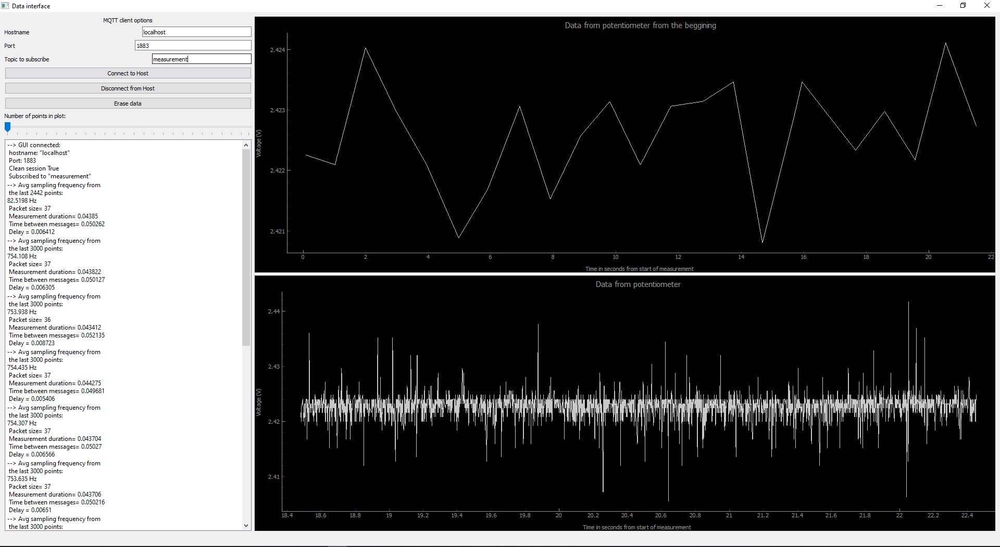

# Projeto Final

## Objetivo:

Pretende-se medir a voltagem na divisão de tensão no poteciómetro dado, enviar os dados através do esp32 para um broker alojado no PC e através também de um cliente local (usando a livraria ) mostrar esses dados em tempo real através de um GUI desenvolvido em PyQt5 usando para suporte gráfico pyqtgraph.  

## Overview da interface gráfica



Do lado direito temos dois gráficos que são a parte principal da interface. O gráfico inferior mostra os dados à medida que vão sendo recebidos pelo broker MQTT e o gráfico superior mostra a evolução temporal dos dados devolvidos pelo potenciómetro desdo o início da medição, onde cada ponto representa o valor médio dos últimos 10 pontos aquando a sua atualização que ocorre a cada segundo. No lado esquerdo, temos algumas opções que permitem configurar a ligação ao broker podendo então ligar a outro além do `localhost`. O botão 'Connect to Host" permite fazer a ligação ao broker com as credenciais definidas e finalmente tem um painel que permite colocar mensagens e é a *porta* de comunicação entre o programa e o utilizador.

## Explicação do código-fonte

### No ESP32

No microcontrolador encontram-se 3 scripts python: `main.py`, `boot.py` e `umqttsimple.py`. O segundo apenas realiza a ligação à rede wifi através do uso do `import network` seguindo um processo standard em todo semelhante ao que foi visto na aula. No ficheiro *main* pretende-se realizar 3 tarefas principais:

1. Configurar a ligação ao broker alojado no PC;
2. Configurar o ADC para a leitura dos dados da tensão na divisão do potenciómetro;
3. LED's na placa apenas para uma "ajuda visual";
4. Configurar dados a enviar para o broker e publica-los.

#### Ligação ao broker

Para a ligação ao broker foi feito uso do pacote `umqttsimple.py` que pretende simplificar o processo de ligação de uma forma intuitiva e simples.

A rotina `connect()` tem como função principal instanciar o cliente mqtt importado de `umqttsimple.py` colocando a identificação dos dispositivo em `client_id` e o endereço IP do servidor em `mqtt_server`. Depois basta chamar o método `.client()` para tentar a ligação. A função `restart_and_reconnect()` destina-se a fazer *reset* ao microcontrolador e tentar uma nova ligação.
```python
topic_pub = b'measurement'

def connect():
    global client_id, mqtt_server

    client = MQTTClient(client_id, mqtt_server)
    client.connect()
    print('Connected to %s MQTT broker' % (mqtt_server))
    return client

def restart_and_reconnect():
    print('Failed to connect to MQTT broker. Reconnecting...')
    sleep(10)
    reset()
```

A ligação é configurada pelas seguintes linhas:
```python
try:
    client = connect()
except OSError as e:
    restart_and_reconnect()
```

#### Recolha de dados pelo ADC

Após ter o esp ligado ao nosso broker temos de retirar dados para poder enviar, para isso fazemos uso do potenciómetro que vinha na placa que pretende simular um sensor. Depois de fazer `from machine import ADC`, é iniciado o objeto ADC no pino dedicado, 32

```python
adc = ADC(Pin(32))
```


Escolhendo ler uma gama total de 0 a 3.3 volts:
```python
adc.atten(ADC.ATTN_11DB)
```
E finalmente escolhemos trabalhar com uma resolução de 12 bits:

```python
adc.width(ADC.WIDTH_12BIT)
```


